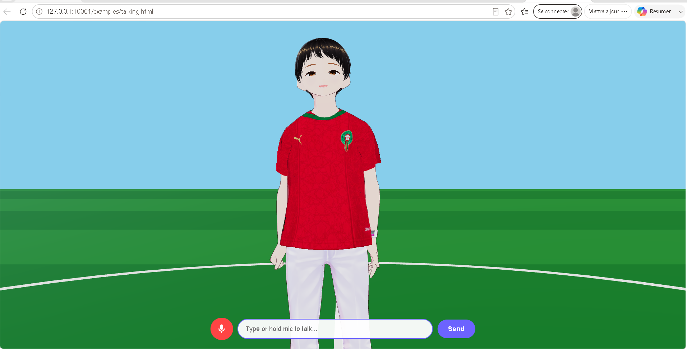

# VRM Talking Avatar



An interactive 3D avatar powered by VRM, Three.js, Google Gemini, and ElevenLabs. The avatar can talk, dance, walk, wave, clap, and respond to voice commands.

## Features

- **AI Chat** — Powered by Google Gemini (text + function calling)
- **Voice Input** — Hold the mic button to speak (ElevenLabs STT)
- **Voice Output** — Text-to-speech with ElevenLabs (real-time lip sync)
- **Animations** — Mixamo FBX animations: idle, talking, walking, dancing, waving, clapping, sad, surprised
- **Dance** — Samba and Gangnam Style with music
- **Walk** — Walk in any direction and return
- **Function Calling** — The AI decides when to dance, walk, wave, etc. based on conversation context

## Setup

### 1. Get API Keys

- **ElevenLabs**: Sign up at [elevenlabs.io](https://elevenlabs.io), get your API key and create a voice (or use a default one)
- **Google Gemini**: Get an API key from [Google AI Studio](https://aistudio.google.com/apikey)

### 2. Configure

Open `index.html` and replace the placeholder keys:

```javascript
const ELEVEN_LABS_API_KEY = 'YOUR_ELEVENLABS_API_KEY';
const ELEVEN_LABS_VOICE_ID = 'YOUR_ELEVENLABS_VOICE_ID';
const GEMINI_API_KEY = 'YOUR_GEMINI_API_KEY';
```

### 3. Run

Serve the folder with any static file server:

```bash
# Using Python
python -m http.server 8000

# Using Node.js
npx serve .

# Using PHP
php -S localhost:8000
```

Then open `http://localhost:8000` in your browser.

## Project Structure

```
vrm-talking-avatar/
├── index.html              # Main app
├── loadMixamoAnimation.js  # Mixamo FBX to VRM converter
├── mixamoVRMRigMap.js      # Bone mapping for Mixamo
├── lib/
│   └── three-vrm.module.js # @pixiv/three-vrm library
├── models/
│   ├── morocco_boy.vrm     # Default VRM avatar
│   ├── standing_idle.fbx   # Default idle animation
│   ├── talking.fbx         # Talking gesture animation
│   ├── walking.fbx         # Walking animation
│   ├── clapping.fbx        # Clapping animation
│   ├── waving.fbx          # Waving animation
│   ├── sad_idle.fbx        # Sad animation
│   ├── surprised.fbx       # Surprised animation
│   ├── samba_dancing.fbx   # Samba dance animation
│   ├── gangnam_style.fbx   # Gangnam Style animation
│   ├── samba_music.mp3     # Samba music
│   └── gangnam_style.mp3   # Gangnam Style music
└── README.md
```

## Commands the AI understands

- **Dance**: "dance", "samba", "gangnam style"
- **Stop**: "stop", "enough"
- **Walk**: "walk forward", "go left"
- **Wave**: "wave", "say hi"
- **Clap**: "clap", "bravo"
- **Sad**: "be sad"
- **Surprised**: "wow"

## Customization

### Change Avatar
Replace `models/morocco_boy.vrm` with any VRM file. You can create one with [VRoid Studio](https://vroid.com/en/studio).

### Add Animations
Download FBX animations from [Mixamo](https://www.mixamo.com) (Without Skin), put them in `models/`, and add them to `actionMap` in the code.

### Change Voice
Create a voice in ElevenLabs Voice Design and update `ELEVEN_LABS_VOICE_ID`.

### Change AI Personality
Edit the `systemInstruction` string in `index.html`.

## Tech Stack

- [Three.js](https://threejs.org/) — 3D rendering
- [@pixiv/three-vrm](https://github.com/pixiv/three-vrm) — VRM avatar loading
- [Google Gemini](https://ai.google.dev/) — LLM with function calling
- [ElevenLabs](https://elevenlabs.io/) — TTS & STT
- [Mixamo](https://www.mixamo.com/) — Character animations

## License

MIT
